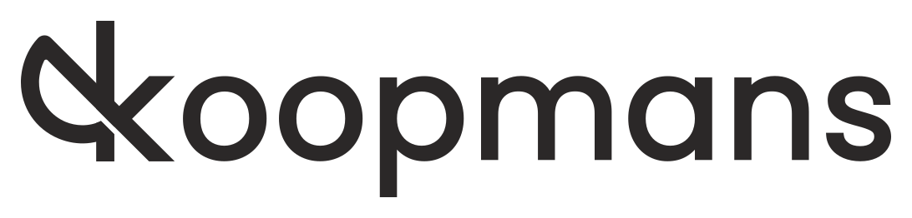

   a package for performing and automating Koopmans functional calculations

.. note:: Online school

  We will be holding an online virtual tutorial titled 
  
  **Advanced Quantum ESPRESSO tutorial: Hubbard and Koopmans functionals from linear response**

  from 9 to 11 November 2022. Register now `here <https://sites.google.com/view/hubbard-koopmans/home>`_

Contents
--------
.. toctree::
   :maxdepth: 2

   about
   quick_start
   theory
   installation
   input_file
   running
   modules
   tutorials
   support
   references
   links
