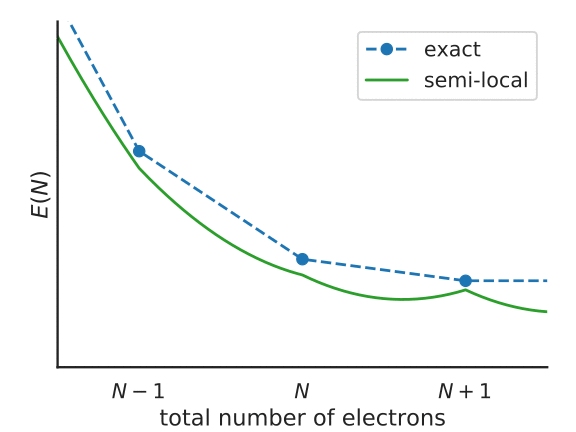

Koopmans functionals
====================

.. _theory_motivating_idea:

The motivating idea behind the functionals
------------------------------------------

We saw from the previous section that DFT Kohn-Sham eigenvalues...

a. are not formally related to quasiparticle energies
b. suffer from self-interaction error

These two points inspire the design of Koopmans functionals. The key idea behind these functionals is that we desire a functional whose orbital\ [#]_ energies

.. math:: \varepsilon^\text{Koopmans}_i = \langle \varphi_i | H | \varphi_i \rangle = \frac{dE_\text{Koopmans}}{df_i}

possess two key properties:

1. :math:`\varepsilon^\text{Koopmans}_i` is independent of the corresponding orbital occupancy :math:`f_i`

2. :math:`\varepsilon^\text{Koopmans}_i` is equal to the corresponding DFT total energy difference
   :math:`\Delta E^\text{Koopmans}_i` that corresponds to the addition/removal of an electron from the corresponding orbital :math:`i`
   
Property 1 means that we will be SIE-free, because the curvature of :math:`E^\text{Koopmans}` with respect to :math:`f_i` will be zero for every orbital :math:`i`. Meanwhile, property 2 is a necessary condition for piecewise linearity of the total energy. It also means that the quasiparticle energies are on much more stable theoretical footing, because they are expressly related to total energy differences, which are ground-state properties.

.. _theory_generic_koopmans_functional:

Derivation of the functionals
-----------------------------

So how do we construct a functional that posesses these properties? The brief derivation is as follows: let us assume a functional of the form

.. math::

   E^\text{Koopmans} = E^{DFT} + \sum_i \Pi_i

This is a "corrective" functional -- that is, we start from the exact or an approximate DFT energy functional :math:`E^{DFT}` (the "base" functional) and add some as-of-yet undetermined corrections :math:`\Pi_i` to each orbital (indexed by :math:`i`).
If we take the derivative with respect to the occupancy of the :math:`j^{\rm th}` orbital then we have

.. math::

   \eta_j = \left.\frac{dE^{DFT}}{df_j}\right|_{f_j=s} + \left.\frac{d\Pi_j}{df_j}\right|_{f_j=s} = \langle \varphi_j| \hat h^\text{DFT}(s)|\varphi_j\rangle
   + \left.\frac{d\Pi_j}{df_j}\right|_{f_j=s}

where we assumed that the cross-term derivatives :math:`d\Pi_i/df_j` vanish, and because :math:`E^\text{Koopmans}` ought to be linear in :math:`f_j`,  we replaced its derivative with some yet-to-be deterimined constant :math:`\eta_j`. For the second equality we invoked Janak's theorem.

Assuming that the our energy correction :math:`\Pi_j` is zero at integer occupancies, and neglecting for the moment any orbital relaxation as the orbital occupancies change, it follows that

.. math::

   \Pi^u_j =  - \int_0^{f_j} \langle \varphi_j| \hat h^\text{DFT}(s)|\varphi_j\rangle ds + f_j \eta_j

where the :math:`u` superscript denotes the fact that we neglected orbital relaxation, and thus this term is "unscreened". To account for this screening we must introduce some screening parameters :math:`\{\alpha_i\}` such that :math:`\Pi_j = \alpha_j \Pi^u_j`.

Thus we arrive at the form of the Koopmans functional: 

.. math::

   E^\text{Koopmans} [\rho,
   {\{f_i\}}, {\{\alpha_i\}}]
   = {E^{DFT}[\rho]}
   + \sum_i
   {\alpha_i}
   \left(
   {- \int^{f_i}_{0}
   \langle \varphi_i | \hat{h}^{\rm DFT}(s) | \varphi_i \rangle ds}
   {+ f_i \eta_i}
   \right)

This functional, by construction, has orbital energies that possess two key properties discussed :ref:`above <theory_motivating_idea>`.

Understanding the functional
----------------------------

To understand this functional a little better, consider the following figure, that represents the total energy of a system with :math:`N + f_i` electrons, with a partially-occupied frontier orbital :math:`i`.

   Illustration of the Koopmans functional, term-by-term
   
What energy does the Koopmans functional assign to this system? Well, it starts with the energy given by the base functional :math:`E^{DFT}[\rho]`. This is denoted as point 1 in the above figure. From this term we subtract :math:`\alpha_i\int^{f_i}_{0} \langle \varphi_i | \hat{h}^{\rm DFT}(s) | \varphi_i \rangle ds` -- that is, we remove the spurious non-linear dependence of the energy on the orbital occupancy. This takes us from point 1 to point 2 in the figure. Finally we add back in :math:`\alpha_i f_i \eta_i`, a term that is linear in :math:`f_i` with some as-of-yet unspecified gradient :math:`\alpha_i\eta_i` (point 3).

The end result is that :math:`E^\text{Koopmans}` is explicitly linear in :math:`f_i` and thus it satisfies property 1 by construction. As for property 2, the value of :math:`\varepsilon^\text{Koopmans}_i` is given by :math:`\alpha_i \eta_i`. We will therefore choose our these two parameters in order to guarantee that these quasiparticle energies correspond to the desired total energy differences. We will discuss how exactly this is done :ref:`later <theory_screening>`.

----

.. [#] To be specific, by "orbitals" we mean the *variational* orbitals (explained :ref:`here <theory_vorbs_vs_corbs>`)
