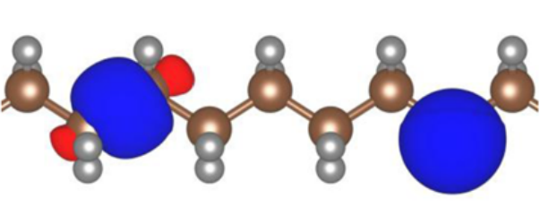
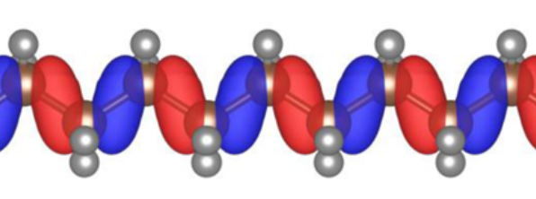

.. _theory_ingredients:

The key ingredients in a Koopmans calculation
=============================================

.. _theory_vorbs_vs_corbs:

The variational orbitals
------------------------
The one important distinction that is worth making right away is that Koopmans functionals are not density functionals, but *orbital-density-dependent* (ODD) functionals. This is because in addition to being dependent on the total density :math:`\rho` they are also dependent on the individual occupancies. Indeed, each orbital will be subjected to a different potential, and when we solve a Koopmans functional we must minimise the total energy with respect to the entire set of orbitals as opposed to just the total density.

A further complication of ODDFTs is that we actually have *two* sets of orbitals that we must be careful to distinguish. The set of orbitals that minimise the total energy are the so-called *variational* orbitals. Because the leading term in an orbital's Koopmans potential is the negative of that orbital's self-Hartree energy, these variational orbitals tend to be very localised.

   Two variational orbitals of polyethylene. Figure taken from :cite:`Nguyen2018`

If we have minimised the total Koopmans energy we can then construct the Hamiltonian. If we then diagonalise this Hamiltonian we would obtain the so-called *canonical* orbitals. In a DFT framework, diagonalising the Hamiltonian would yield exactly the same orbitals that minimise the total energy. However, in an ODDFT, this is not the case, because the total energy is not invariant with respect to unitary rotations of a given set of orbitals, and thus the variational and canonical orbitals are different. In contrast to the variational orbitals, the canonical orbitals are typically very delocalised and much more closely resemble the Kohn-Sham orbitals of DFT. 

   A canonical orbital of polyethylene. Figure taken from :cite:`Nguyen2018`

.. note::

   Transforming a DFT to an ODDFT may seem like a bothersome complication but actually it is a natural generalization -- indeed, an ODDFT is in fact an energy-discretized spectral functional theory :cite:`Ferretti2014`.

.. _theory_screening:

The screening parameters
------------------------

In any Koopmans calculation, we must obtain the set of screening parameters :math:`\{\alpha_i\}`. As we discussed earlier, we would like the functional's total energy to be piecewise linear i.e. we would like quasiparticle energy to match the corresponding total energy differences.

Specifically, we would like :math:`\varepsilon^\text{Koopmans}_i = \Delta E^\text{Koopmans}_i`, where

.. math::

   \Delta E^\text{Koopmans}_i =
   \begin{cases}
      E^\text{Koopmans}(N) - E^\text{Koopmans}_i(N-1)
      & \text{filled orbitals}\\
      E^\text{Koopmans}_i(N+1) - E^\text{Koopmans}(N)
      & \text{empty orbitals}
   \end{cases}

where :math:`E^\text{Koopmans}_i(N\pm1)` is the total energy of the system where we add/remove an electron from variational orbital :math:`i` and allow the rest of the system to relax.

We will use this condition to determine the screening parameters `ab initio`. In order to do so, there are two potential approaches: (a) via :ref:`ΔSCF calculations <theory_dscf>` or (b) via :ref:`DFPT <theory_dfpt>`.

.. _theory_dscf:

ΔSCF
^^^^

In this approach, we explicitly calculate all of the energy differences :math:`\Delta E_i^\text{Koopmans}` via a series of constrained Koopmans or DFT calculations. Specifically, given a starting guess :math:`\{\alpha^0_i\}` for the screening parameters, an improved guess for the screening parameters can be obtained via

.. math::

   \alpha^{n+1}_i =
   \alpha^n_i \frac{\Delta E_i - \varepsilon_{i}^0(1)}{\varepsilon_{i}^{\alpha^n_i}(1) - \varepsilon_{i}^0(1)}

for filled orbitals and

.. math::

   \alpha^{n+1}_i =
   \alpha^n_i \frac{\Delta E_i - \varepsilon_{i}^0(0)}{\varepsilon_{i}^{\alpha^n_i}(0) - \varepsilon_{i}^0(0)}

for empty orbitals, where

.. math::

   \varepsilon_{i}^{\alpha_i}(f) = \left.\frac{\partial E^\text{Koopmans}}{\partial f_i}\right|_{f_i = f} = \left.\langle \varphi_i|\hat H_\text{DFT} + \alpha_i \hat v_i^\mathrm{Koopmans}|\varphi_i \rangle\right|_{f_i = f}

All of these quantities for calculating :math:`\alpha^{n+1}_i` are obtained from constrained Koopmans and DFT calculations. Specifically, a :math:`N`-electron Koopmans calculation yields :math:`E^\text{Koopmans}(N)`, :math:`\varepsilon^{\alpha_i^n}_i`, and :math:`\varepsilon^{0}_i`, and a constrained :math:`N \pm 1`-electron calculation yields :math:`E^\text{Koopmans}_i(N \pm 1)`.

Typically, very few iterations are required in order to reach self-consistency.

.. note::

   For a periodic system, this method for determining the screening parameters requires a supercell treatment. This is because the :math:`N \pm 1`-electron systems have a charged defect and a supercell is required in order to avoid spurious interactions between periodic images.

.. _theory_dfpt:

DFPT
^^^^
While the ΔSCF approach can provide us with all of the ingredients to calculate the screening parameters, it is a somewhat cumbersome approach. We must perform several constrained DFT/Koopmans calculations, and for periodic systems these must be performed in a supercell.

An alternative to the ΔSCF approach is to take advantage of density functional perturbation theory (DFPT) :cite:`Baroni2001` in order to compute the screening coefficients. In this approach the energy is approximated as a quadratic function of the occupation number, and the expression for the screening coefficients reduces to

.. math::  \alpha_i = \frac{d^2E_{\rm DFT}/df_i^2}{\partial^2 E_{\rm DFT}/\partial f_i^2} = \frac{\langle n_i | \epsilon^{-1} f_{\rm Hxc} | n_i \rangle}{\langle n_i | f_{\rm Hxc} | n_i \rangle} 

where :math:`\frac{d}{df_i}` and :math:`\frac{\partial}{\partial f_i}` represent variations done accounting for the orbitals relaxation or not, respectively, :math:`\epsilon(\mathbf{r},\mathbf{r}')` is the microscopic dielectric function of the material, :math:`f_{\rm Hxc}(\mathbf{r},\mathbf{r}') = \delta^2 E_{Hxc}/ \delta \rho(\mathbf{r})\delta \rho(\mathbf{r}')` is the Hartree-exchange and correlation kernel, and :math:`n_i(\mathbf{r})=|\varphi_i(\mathbf{r})|^2` is the orbital density.

The evaluation of the screening coefficients within this approach only requires quantities available from a :math:`N`-electron calculation. Specifically, we can rewrite the above equation in terms of the density response :math:`\Delta^i \rho` to a perturbing potential :math:`V^i_{\rm pert}` generated by the orbital density :math:`n_i`:

.. math::
   
   \alpha_i = 1 + \frac{\langle V^{i}_{\rm pert} | \Delta^{i} \rho \rangle}{\langle n_{i} | V^{i}_{\rm pert} \rangle}

The advantage of this approach compared to the ΔSCF is that there is no need for a supercell treatment, and in the case of periodic solids a primitive cell implementation can be used. By exploiting Bloch symmetries the linear response formula for the screening coefficients can be decomposed into a set of independent problems, one for each :math:`q` point sampling the Brillouin zone of the primitive cell

.. math::  \alpha_{i} =  1 + \frac{\sum_{\mathbf{q}} \langle V^{i}_{{\rm pert},\mathbf{q}} | \Delta^{i}_{\mathbf{q}}\rho \rangle} {\sum_{\mathbf{q}} \langle \rho^{i}_{\mathbf{q}} | V^{i}_{{\rm pert}, \mathbf{q}} \rangle}

This greatly reduces the computational cost of the calculation (see below), but as a consequence the DFPT approach has a few limitations:

1. We have approximated the energy to second order. In most cases this is very accurate, correctly capturing the leading Hartree contribution and only missing higher-order xc contributions. 
2. It is only currently implemented for the KI functional. For KIPZ, the PZ kernel (i.e. the second derivative of the PZ energy with respect to the density) is required and this is not implemented in common electronic structure codes. (See :ref:`below <theory_koopmans_flavours>` for an explanation of what we mean by "KI" and "KIPZ".)

For more details regarding the DFPT method, see :cite:`Colonna2019`.

Computational scaling for periodic systems
^^^^^^^^^^^^^^^^^^^^^^^^^^^^^^^^^^^^^^^^^^
In the ΔSCF approach, the screening coefficients are computed within a supercell and with a finite difference approach, by performing additional total-energy calculations where the occupation of a single variational orbital is constrained :cite:`Nguyen2018`. This requires an SCF calculation per orbital, which takes a computational time :math:`T^{\rm SC}` that roughly scales as :math:`\mathcal{O}\left(\left({N_{\rm el}^{\rm SC}}\right)^3\right)`, where :math:`N_{\rm el}^{\rm SC}` is the number of electrons in the supercell.

The DFPT approach scales as :math:`T^{\rm PC} \propto N_{\mathbf{q}} N_{\mathbf{k}} {N_{\rm el}^{\rm PC}}^3`. This is the typical computational time for the SCF cycle 
:math:`N_{\mathbf{k}} {N_{\rm el}^{\rm PC}}^3`, times the number of independent monochromatic perturbations :math:`N_{\mathbf{q}}`.

Using the relation :math:`N_{\rm el}^{\rm SC}=N_{\mathbf{k}}N_{\rm el}^{\rm PC}`, and the fact that :math:`N_{\mathbf{q}}=N_{\mathbf{k}}`, the ratio between the supercell and primitive computational times is :math:`T^{\rm SC}/T^{\rm PC} \propto N_{\mathbf{q}}`. Therefore as the supercell size (and, equivalently, the number of :math:`\mathbf{q}`-points in the primitive cell) increases, the primitive-cell-DFPT approach becomes more and more computationally efficient.

.. _theory_koopmans_flavours:

The flavour: KI or KIPZ
-------------------------------
As we have seen :ref:`previously <theory_generic_koopmans_functional>`, there is some freedom in how we define our Koopmans functional. Namely, we need to choose values for :math:`\eta_i`, the gradient of the energy as a function of the the occupancy of orbital :math:`i`, for each value of :math:`i` (modulo the corresponding screening term).

There are several different ways to define these gradient terms, and each approach gives rise to a different "flavour" of Koopmans functionals.

KI
^^
In the "KI" approach, :math:`\eta_i` is chosen as the total energy difference of two adjacent electronic configurations with integer occupations:

.. math::

    \eta_i^{\rm KI} = E^{\rm DFT}[f_i=1]-E^{\rm DFT}[f_i=0] = \int_0^{1} \langle \varphi_i | \hat{h}^{\rm DFT}(s) | \varphi_i \rangle ds

in which case the explicit expression for the unscreened KI Koopmans' correction becomes

.. math::

   \Pi^{\rm KI}_i = f_i \eta^{\rm KI}_i = E_{\rm Hxc} [\rho-\rho_i] -E_{\rm Hxc}[\rho] +f_i \left( E_{\rm Hxc}[\rho-\rho_i+n_i] -E_{\rm Hxc}[\rho-\rho_i] \right)

where :math:`\rho_i(\mathbf{r}) = f_i|\varphi_i(\mathbf{r})|^2` and :math:`n_i(\mathbf{r}) = |\varphi_i(\mathbf{r})|^2`. :math:`E_{\rm Hxc}` denotes the Hartree and exchange-correlation energy corresponding to the underlying base functional.

.. note::

   It can be seen that at integer occupations, the KI energy correction vanishes i.e. :math:`\Pi^{\rm KI}_i=0`. In other words, the KI functional preserves the potential energy surface of the base functional! But while the energy is vanishing, the potential is non-vanishing, which means that the KI correction will affect the spectral properties of the system.

KIPZ
^^^^

In the "KIPZ" approach, the slope :math:`\eta_i` is also chosen as the total energy difference of two adjacent electronic configurations with integer occupations, but this time using the Perdew-Zunger (PZ) one-electron-self-interaction corrected (SIC) functional applied to the approximate DFT base functional:

.. math::

    \eta_i^{\rm KIPZ} = E^{\rm PZ}[f_i=1]-E^{\rm PZ}[f_i=0] = \int_0^{1} \langle \varphi_i | \hat{h}_i^{\rm PZ}(s) | \varphi_i \rangle ds,
                  \label{eta_kipz}

providing the explicit expression for the unscreened :math:`\Pi_i^{\rm KIPZ}` correction

.. math::

 \Pi_i^{\rm KIPZ} = -\int_0^{f_i} \langle \varphi_i | \hat{h}^{\rm DFT}(s) | \varphi_i \rangle ds + f_i \int_0^{1} \langle \varphi_i | \hat{h}^{\rm PZ}_i(s) | \varphi_i \rangle ds\;.

where

.. math::
   
   \hat{h}_i^{\rm PZ}(s) = \hat{h}^{\rm DFT}(s) - \hat{v}^{\rm DFT}_{\rm Hxc}\left[s|\varphi_i(\mathbf{r})|^2\right]

is the PZ self-interaction correction applied to the :math:`i^{\rm th}` variational orbital. This correction removes the Hartree-plus-exchange-correlation potential for that orbital.

This correction can be rewritten as

.. math::

     \Pi^{\rm KIPZ}_i = \Pi^{\rm KI}_i -f_i E_{\rm Hxc} [n_i]

.. note::
   
   In the unscreened case (:math:`\alpha_i = 1`) the KIPZ functional can be thought of as the KI correction applied to the PZ-SIC functional (this can be verified by replacing the base DFT functional and Hamiltonian with its PZ-SIC counterparts). However, in the general case of :math:`\alpha_i \ne 1` the KIPZ functional form implies also scaling each PZ self-interaction correction with its own screening coefficient.

For more details, refer to :cite:`Borghi2014`.
