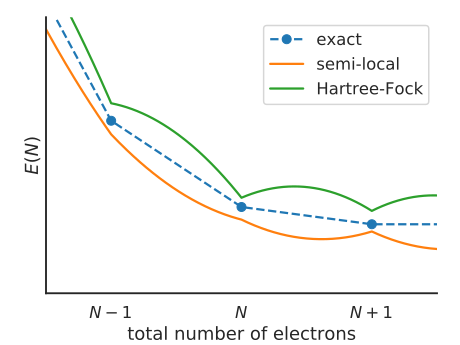

Quasiparticle energies, piecewise linearity, and Koopmans' theorem
==================================================================

Density functional theory (DFT) is a remarkably successful theory. However, its prediction of quasiparticle energies is very unreliable. Indeed, while the Kohn-Sham eigenvalues may loosely mirror experimental quasiparticle energies, there is formally no connection between the two (except for the HOMO in exact DFT, which is related to the decay of the density at large distances).

Furthermore, because DFT is an approximate theory the Kohn-Sham orbitals suffer from a few well-known errors, making them an even worse proxy for quasiparticle energies. Chief among these errors is "self-interaction error" (SIE).

DFT suffers from "one-body self-interaction error" because of the way it treats the Hartree term. For a wavefunction represented by a single Slater determinant, the Hartree term :math:`\Phi_i` felt by the i\ :sup:`th` particle is given by

.. math::

   \Phi_i(\mathbf{r}) = \sum_{i\neq j} \int d\mathbf{r}' \frac{|\psi_{n_j}(\mathbf{r}')|^2}{|\mathbf{r} - \mathbf{r}'|}
   
but in DFT we replace this orbital-dependent term with 

.. math::

    \Phi(\mathbf{r}) = \int d\mathbf{r}' \frac{\rho(\mathbf{r})}{\mathbf{r} - \mathbf{r'}}

which ignores the :math:`i \neq j` of the sum. This would be perfectly fine if the xc-functional perfectly cancelled this self-Hartree term, but most xc-functionals do not. Consequently, KS particles tend to over-delocalise in order to minimise the Coulomb repulsion they feel from their own density.

More generally, DFT suffers from "many-body self-interaction error" (or "delocalisation error"). This manifests itself as an erroneous curvature in the total energy :math:`E(N)` of the system as a function of the total number of electrons :math:`N`. Compare this to the exact functional, which we know should be piecewise-linear between the energy at integer occupancies.

    :math:`E(N)` for the exact functional, semi-local DFT, and Hartree-Fock

This erroneous curvature directly impacts the Kohn-Sham eigenvalues. For instance, consider the energy of the highest occupied molecular orbital (HOMO), which is given by

.. math::

    \varepsilon_{HO} = \left.\frac{\partial E}{\partial N}\right|_{N = N^-}

that is, the gradient of :math:`E(N)` approaching :math:`N` from the left. In principle, this energy should be equal to the (indeed we can see this for the exact functional, where the gradient is given by

.. math::

    \varepsilon^\text{exact}_{HO} = \left.\frac{\partial E^\text{exact}}{\partial N}\right|_{N = N^-} = E^\text{exact}(N) - E^\text{exact}(N-1)

However, we can see in the following figure that due to the erroneous curvature in the semi-local functional

.. math::

    \varepsilon^\text{sl}_{HO} = \left.\frac{\partial E^\text{sl}}{\partial N}\right|_{N = N^-} > E^\text{sl}(N) - E^\text{sl}(N-1)

.. figure:: figures/fig_en_curve_sl_annotated_zoom.svg
    :align: center
    :width: 400
    :alt: close-up of the curvature of semi-local DFT and how it impacts quasiparticle energies

    Close-up of :math:`E(N)` for semi-local DFT, showing the consequences of SIE for quasiparticle energies

That is, the Kohn-Sham HOMO eigenvalue is overestimated due to the presence of SIE.

It is not just the HOMO energy that is affected by SIE. By similar logic we can show that SIE affects all of the Kohn-Sham eigenvalues, and by extension it will detrimentally affect spectral properties such as densities of states, band structures, and optical spectra.

Given these failures of semi-local DFT, the question becomes how can we relate Kohn-Sham eigenvalues to quasiparticles while addressing self-interaction? The answer: Koopmans functionals.

TODO discuss Koopmans theorem
