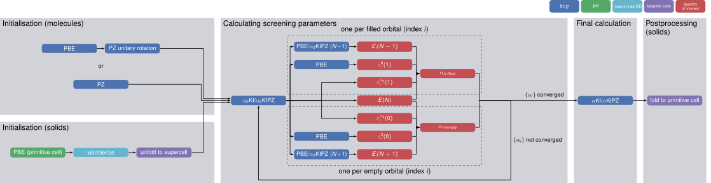
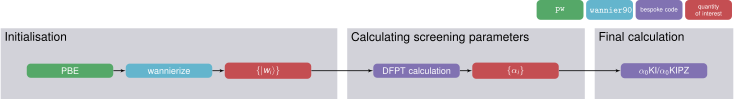

The Koopmans workflows
======================

In a semi-local DFT calculation, all that one needs to do is obtain the ground state density. As discussed in the previous section, for Koopmans calculations we must also obtain the minimising variational orbitals as well as the screening parameters. This means that, compared to a standard semi-local DFT calculation, a few additional steps are required.

Typically, a Koopmans calculation can be divided into three stages

1. an initialization step, where the density and variational orbitals are initialized
2. the calculation of screening parameters
3. a final calculation using the obtained variational orbitals and screening parameters
   
Depending on the method for calculating screening parameters, the resulting workflow can look quite different. Differences also emerge between molecules and solids. For the latter, maximally localised Wannier functions are typically used as variational orbitals, which necessitates an additional Wannierization procedure, performed using `Wannier90 <http://www.wannier.org/>`_.

    
    Flowchart of the ΔSCF workflow (click to enlarge)

    
    The DFPT workflow (click to enlarge)

As you can see, these workflows can become quite complicated, but do not worry! The ``koopmans`` code automates the process of running these workflows.
