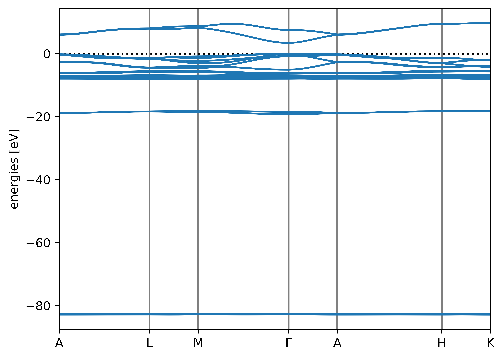
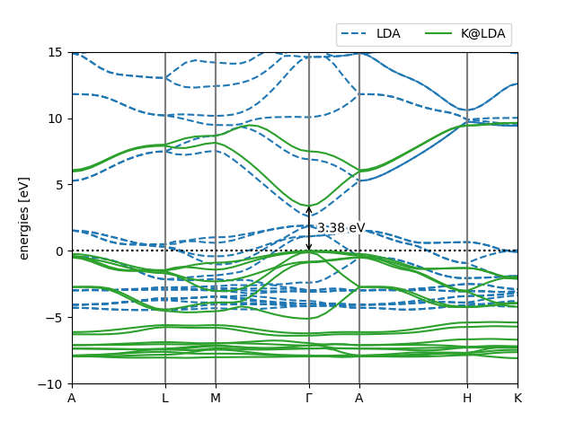
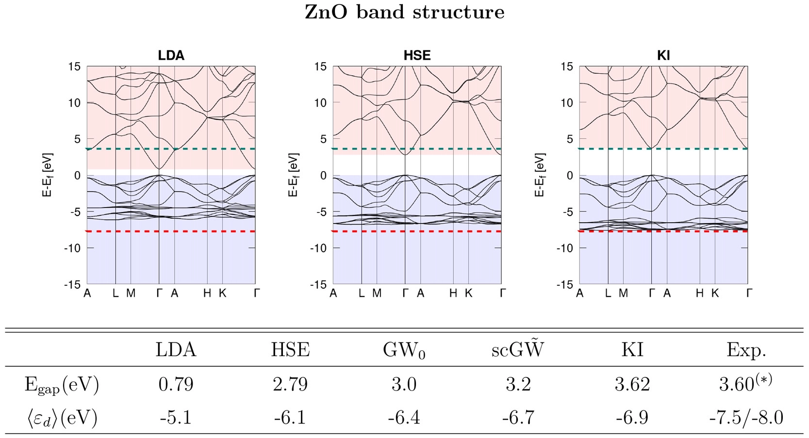

.. _tutorial_3:

Tutorial 3: the band structure of ZnO (calculated with explicit k-points)
=========================================================================

In this tutorial we will calculate the band structure of bulk zinc oxide using the k-space formulation of Koopmans. The input file for this tutorial can be downloaded :download:`here <../../tutorials/tutorial_3/zno.json>`.

Calculating the Koopmans band structure
---------------------------------------

The input file
^^^^^^^^^^^^^^

First, let us inspect the input file:

.. literalinclude:: ../../tutorials/tutorial_3/zno.json
  :lines: 1-9
  :lineno-start: 1
  :emphasize-lines: 4,6,8-9

Here we tell the code to calculate the KI bandstructure using the DFPT primitive cell approach. We will not actually calculate the screening parameters in this tutorial (because this calculation takes a bit of time) so we have set ``calculate_alpha`` to ``False`` and we have provided some pre-computed screening parameters in the ``alpha_guess`` field.

The rest of the file contains the atomic coordinates, k-point configuration, and calculator parameters (including the Wannier projectors, which we will discuss later).

Running the calculation
^^^^^^^^^^^^^^^^^^^^^^^

Running ``koopmans zno.json`` should produce an output with several sections: after the header there is the Wannierization

.. literalinclude:: ../../tutorials/tutorial_3/zno.out
  :lines: 16-36
  :lineno-start: 16
  :language: text

which is very similar to what we saw for silicon, except now we have several blocks for the occupied manifold (discussed below). Then we have 

.. literalinclude:: ../../tutorials/tutorial_3/zno.out
  :lines: 37-40
  :lineno-start: 37
  :language: text

where the ``Wannier90`` files are converted into a format readable by the ``kcw.x`` code.

If we had instructed the code to calculate the alpha parameters, this would be followed by an extra block where these are calculated. But since we have already provided these, the workflow progresses immediately to the final step

.. literalinclude:: ../../tutorials/tutorial_3/zno.out
  :lines: 42-46
  :lineno-start: 42
  :language: text

where the Koopmans Hamiltonian is constructed, and the band structure computed.

Plotting the results
^^^^^^^^^^^^^^^^^^^^

Running the workflow will have produced several directories containing various input and output ``Quantum ESPRESSO`` files. It will also have generated ``png`` band structure plots, including this one of the Koopmans band structure:

  The autogenerated band structure plot for ZnO

However, suppose we want to make a nicer, more comprehensive plot comparing the LDA and Koopmans band structures. To achieve this, we will load all of the information from the ``zno.kwf`` file. This will provide us with a ``SinglepointWorkflow`` object which contains all of the calculations and their associated results. For example, we can access the calculations corresponding to the Koopmans and LDA band structures as follows:

.. literalinclude:: ../../tutorials/tutorial_3/plot_bandstructures.py
  :lines: 5-14

and then the band structures are in the ``results`` dictionary of these calculators:

.. literalinclude:: ../../tutorials/tutorial_3/plot_bandstructures.py
  :lines: 16-22

These band structures are ``BandStructure`` objects `(documented here) <https://wiki.fysik.dtu.dk/ase/ase/dft/kpoints.html?highlight=bandstructure#ase.spectrum.band_structure.BandStructure>`_. Among other things, this class implements a ``plot`` function that allows us to plot them on the same set of axes:

.. literalinclude:: ../../tutorials/tutorial_3/plot_bandstructures.py
  :lines: 24-26

With a few further aesthetic tweaks (download the full script :download:`here <../../tutorials/tutorial_3/plot_bandstructures.py>`) we obtain the following plot:

  Pretty band structure plot comparing the LDA and Koopmans band structures of ZnO

This script has also labelled the band gap for us, which is 3.55 eV. This is pretty close to the 3.62 eV result from Ref. :cite:`Colonna2022` (see the below figure). The slight discrepancy comes from the fact that this tutorial has used coarser parameters to make the calculations run quickly.

  The band structure of ZnO from Colonna et al. :cite:`Colonna2022`

.. _projections_blocks_explanation:

Bonus material: understanding the Wannier projections
-----------------------------------------------------

The first step to any calculation on a periodic system is to obtain a good set of Wannier functions. These depend strongly on our choice of the projections, which (for the moment) we must specify manually.

In the above calculation we gave you some Wannier projections to use:

.. literalinclude:: ../../tutorials/tutorial_3/zno.json
  :lines: 47-63
  :lineno-start: 47

But what if you need to come up with your own Wannier projections? In this bonus section we will explain how to work out Wannier projections for yourself.

Configuring the Wannierization
^^^^^^^^^^^^^^^^^^^^^^^^^^^^^^

To determine a good choice for the Wannier projections, we can first calculate a projected density of states (pDOS). Take your input file and change the ``task`` from ``singlepoint`` to ``dft_bands``, and then run ``koopmans zno.json``. This will run the DFT bandstructure workflow, which will produce a directory called ``dft_bands`` that contains various files, including a ``png`` of the bandstructure and pDOS. If you look at this file, you will see that the DFT band structure of ZnO consists of several sets of bands, each well-separated in energy space. As the pDOS shows us, the filled bands correspond to zinc 3s, zinc 3p, oxygen 2s, and then zinc 3d hybridized with oxygen 2p. Meanwhile, the lowest empty bands correspond to Zn 4s bands.

A sensible choice for the occupied projectors is therefore

.. code:: json

    "w90": {
       "occ": {
       "projections_blocks": [
           [{"site": "Zn", "ang_mtm": "l=0"}],
           [{"site": "Zn", "ang_mtm": "l=1"}],
           [{"site": "O", "ang_mtm": "l=0"}],
           [{"site": "Zn", "ang_mtm": "l=2"},
            {"site": "O", "ang_mtm": "l=1"}]
       ]  
  
Here we will use of the ``projections_blocks`` functionality to wannierize each block of bands separately. If we didn't do this, then the Wannierization procedure might mix orbitals from different blocks of bands (the algorithm minimizes the spatial spread without regard to the energies of the orbitals it is mixing). This sort of mixing between orbitals of very different energies is generally detrimental to the Wannierization and the resulting Koopmans band structure.

For the empty bands we want to obtain two bands corresponding to the Zn 4s orbitals. These must be disentangled from the rest of the empty bands, which is achieved via the following ``Wannier90`` keywords.

``dis_win_max``
  defines the upper bound of the disentanglement energy window. This window should entirely encompass the lowest two bands corresponding to our Zn 4s projectors. Consequently, it will inevitably include some weights from higher bands

``dis_froz_max``
  defines the upper bound of the frozen energy window. This window should be as large as possible while excluding any bands that do not correspond to our Zn 4s projectors

To determine good values for these keywords, we clearly need a more zoomed-in band structure than the default. We can obtain this via the ``*.fig.pkl`` files that ``koopmans`` generates. Here is a short code snippet that replots the band structure over a narrower energy range

.. literalinclude:: ../../tutorials/tutorial_3/replot_dft_bandstructure.py

Based on this figure, choose values for these two keywords and add them to your input file, alongside the definition of your projectors, as follows:

.. code-block:: json
   :emphasize-lines: 2-3

       "emp": {
          "dis_froz_max": "?",
          "dis_win_max": "?",
          "projections": [
              {"site": "Zn", "ang_mtm": "l=0"}
          ]  

.. note::

  ``dis_froz_max`` and ``dis_win_max`` should **not** be provided relative to the valence band edge. Meanwhile the band structure plots have set the valence band edge to zero. Make sure to account for this by shifting the values of ``dis_froz_max`` and ``dis_win_max`` by 9.3 eV (the valence band edge energy; you can get this value yourself via ``grep 'highest occupied level' dft_bands/scf.pwo``)

Testing the Wannierization
^^^^^^^^^^^^^^^^^^^^^^^^^^

To test your wannierization, you can now switch to the ``wannierize`` task and once again run ``koopmans zno.json``. This will generate a ``wannier`` directory as well as a band structure plot, this time with the interpolated band structure plotted on top of the explicitly evaluated band structure. Ideally, the interpolated band structure should lie on top of the explicit one. Play around with the values of ``dis_froz_max`` and ``dis_win_max`` until you are happy with the resulting band structure.

.. hint::

  Instead of using the ``*.fig.pkl`` file to obtain a zoomed-in band structure, add a ``plotting`` block to your json input file to manually set the y-limits:

  .. code:: json
    
    "plotting": {
      "Emin": -5.0
      "Emax": 15
    }