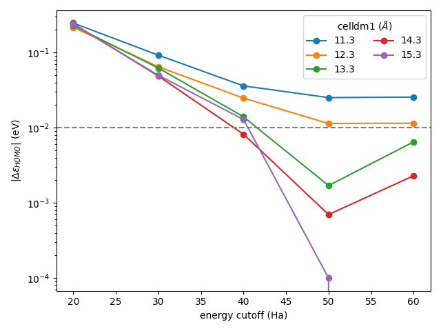

Tutorial 4: convergence testing
===============================
While ``koopmans`` is a package primarily oriented towards performing Koopmans spectral functional calculations, it does have a couple of other useful functionalities. In this tutorial, we will make use of its ``convergence`` task to determine how large a cell size and energy cutoff is required to converge the PBE energy of the highest occupied molecular orbital (HOMO) of a water molecule.

The input file
--------------
In order to run this calculation, our ``workflow`` block needs a few particular keywords:

.. literalinclude:: ../../tutorials/tutorial_4/h2o_conv.json
  :lines: 1-11
  :linenos:
  :emphasize-lines: 4, 6-10

The important lines are highlighted. ``"task": "convergence"`` means that we will be performing a convergence test. The other three highlighted keywords specifying that we are going to converge the HOMO energy to within 0.01 eV, with respect to *both* the energy cutoff ``ecutwfc`` and the cell size. The full input file can be found :download:`here <../../tutorials/tutorial_4/h2o_conv.json>`.

The output file
---------------
When you run the calculation, you should see something like this after the header:

.. literalinclude:: ../../tutorials/tutorial_4/h2o_conv.out
  :lines: 14-32
  :language: text

Here, the code is attempting to use progressively larger energy cutoffs and cell sizes. It will ultimately arrive at a converged solution, with a ``ecutwfc`` of 50.0 Ha and a cell 1.3 times larger than that provided in the ``.json`` input file.

Plotting
--------

The individual ``Quantum ESPRESSO`` calculations reside in nested subdirectories. If you plot the HOMO energies from each of these, you should get something like this:

  
  Plot of the HOMO energy of water with respect to the energy cutoff and cell size (generated using :download:`this script <../../tutorials/tutorial_4/plot.py>`)

We can see that indeed the calculation with ``ecutwfc = 50.0`` and ``cell_size = 1.3`` is the one where the energy of the HOMO goes within (and stays within) 0.01 eV of the most accurate calculation.
