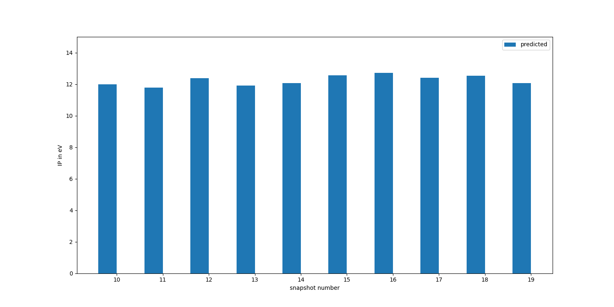
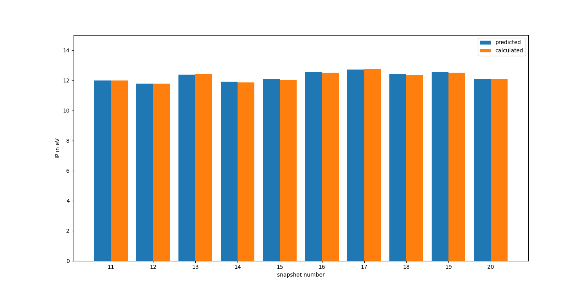

.. _tutorial_5:

Tutorial 5: using machine learning to predict the screening parameters of water molecules
=========================================================================================
In this tutorial, we will train a machine-learning model to predict the screening parameters of water molecules directly from their orbital densities.  To generate a trajectory with 20 different atomic configurations, we run a :download:`python script <../../tutorials/tutorial_5/perturb_positions.py>` that applies random noise to the atomic positions of a water molecule. The resulting atomic positions are saved in a :download:`xyz file <../../tutorials/tutorial_5/tutorial_5b/h2o_convergence_ml.json>` and are visualized below

.. figure:: ../../tutorials/tutorial_5/snapshots.gif
   :width: 400
   :align: center
   :alt: The 20 snapshots generated with perturb_positions.py 

Our goal in this tutorial is to perform Koopmans calculations on each of these 20 snapshots using a machine learning model to predict the screening parameters instead of calculating them ab initio.  

Running a machine learning workflow
-----------------------------------

To predict the screening parameters with the machine learning model we must first train the model. In the following we will use the first five snapshots for training and then use the trained machine learning model to predict the screening parameters for the remaining 15 snapshots. 

The input file for the machine learning workflow
^^^^^^^^^^^^^^^^^^^^^^^^^^^^^^^^^^^^^^^^^^^^^^^^

The input file for performing this task can be downloaded :download:`here <../../tutorials/tutorial_5/tutorial_5a/h2o_trajectory_ml.json>`. 

First, we have to specify that we want to perform Koopmans calculations on a whole trajectory of snapshots by setting the ``"task"`` keyword in the ``"workflow"`` block:

.. literalinclude:: ../../tutorials/tutorial_5/tutorial_5a/h2o_trajectory_ml.json
  :lines: 2-4
  :linenos:
  :emphasize-lines: 2
  :lineno-start: 24

For this task, we don't provide the ``"atomic_positions"`` directly to the input file since we don't want to perform a Koopmans calculation on a single snapshot but on many snapshots. Instead, we provide an xyz file containing all the atomic positions of each snapshot that we would like to simulate

.. literalinclude:: ../../tutorials/tutorial_5/tutorial_5a/h2o_trajectory_ml.json
  :lines: 21-24
  :linenos:
  :emphasize-lines: 4
  :lineno-start: 21

Finally, we have to provide a ``ml`` block with keywords specific to the machine learning model

.. literalinclude:: ../../tutorials/tutorial_5/tutorial_5a/h2o_trajectory_ml.json
  :lines: 13-20
  :linenos:
  :lineno-start: 13

To predict the screening parameters from the orbital densities, we have to translate the orbital densities into input vectors for the machine learning model. To do so, we decompose the orbital densities into radial basis functions :math:`g_{nl}(r)` and angular basis functions :math:`Y_{ml}(\theta,\phi)`. 
This decomposition has the following four hyperparameters that we provided in the input file:

* :math:`n_{max}` determines the number of radial basis functions
* :math:`l_{max}` determines the number of angular basis functions
* :math:`r_{min}` determines the smallest cutoff radius for the radial basis functions
* :math:`r_{max}` determines the largest cutoff radius for the radial basis functions

In anticipation that the machine learning model will be most useful in extended systems (liquids or solids), we apply periodic boundary conditions and use maximally localized Wannier functions as our variational orbitals (despite the fact that our toy water model is not, in fact, a periodic system).

The output file for the machine learning workflow
^^^^^^^^^^^^^^^^^^^^^^^^^^^^^^^^^^^^^^^^^^^^^^^^^

Running this calculation, the output will show that we compute the screening parameters of the first five snapshots ab initio and add the results to our training data

.. literalinclude:: ../../tutorials/tutorial_5/tutorial_5a/h2o_trajectory_ml.out
  :lines: 49-57
  :language: text
  :lineno-start: 49

Then we use the trained model to predict the screening parameters of the remaining snapshots 

.. literalinclude:: ../../tutorials/tutorial_5/tutorial_5a/h2o_trajectory_ml.out
  :lines: 619-621
  :language: text
  :lineno-start: 619

Using the script :download:`plot_5a.py <../../tutorials/tutorial_5/plot_5a.py>` we can plot predicted ionization potentials of the water molecule across the last 10 snapshots. Of course, they don't necessarily correspond to anything physical because these configurations have been randomly generated. But in real applications the snapshots will correspond to something physical and the resulting ionization potentials will be meaningful.

Here there is no way of telling if the model is correct -- it has provided us with some screening parameters and we have to trust it. If we want to check if a machine learning model is working properly what we need to do is a convergence analysis with respect to the number of training data. This will be the goal of the following section. 

Running a convergence analysis
------------------------------

The input file for the convergence analysis
^^^^^^^^^^^^^^^^^^^^^^^^^^^^^^^^^^^^^^^^^^^

The corresponding :download:`input file <../../tutorials/tutorial_5/tutorial_5b/h2o_convergence_ml.json>` differs from the previous input file only in the ``"task"`` keyword

.. literalinclude:: ../../tutorials/tutorial_5/tutorial_5b/h2o_convergence_ml.json
  :lines: 2-4
  :linenos:
  :emphasize-lines: 2

and the ``"number_of_training_snapshots"``

.. literalinclude:: ../../tutorials/tutorial_5/tutorial_5b/h2o_convergence_ml.json
  :lines: 13-24
  :linenos:
  :emphasize-lines: 7

For the ``convergence_ml`` task, setting ``"number_of_training_snapshots": 10`` means that we will perform the convergence analysis with respect to 1, 2, ... , and 10 training snapshots and use the remaining snapshots (in this case snapshots 11 to 20) for testing. 

The ``"quantities_of_interest"`` is the list of parameters with respect to which we would like to perform the convergence analysis. In addition to performing it only with respect to the screening parameters ``"alphas"``, we also perform it with respect to the eigenvalues (``"evs"``).
The latter requires an additional ``final calculation`` for each snapshot and therefore takes slightly longer to run. 

The output file for the convergence analysis
^^^^^^^^^^^^^^^^^^^^^^^^^^^^^^^^^^^^^^^^^^^^

You should see that the workflow first computes the screening parameters ab-initio for the last 10 snapshots.

.. literalinclude:: ../../tutorials/tutorial_5/tutorial_5b/h2o_convergence_ml.out
  :lines: 18-20
  :language: text
  :lineno-start: 18

Next, snapshot 1 is added to the training data. 

.. literalinclude:: ../../tutorials/tutorial_5/tutorial_5b/h2o_convergence_ml.out
  :lines: 732-733
  :language: text
  :lineno-start: 732

After having trained the machine learning model on the orbitals of the first snapshot we use the trained model to predict the screening parameters of the last 10 snapshots and compare our results to the results from the ab initio computation.

.. literalinclude:: ../../tutorials/tutorial_5/tutorial_5b/h2o_convergence_ml.out
  :lines: 849-850
  :language: text
  :lineno-start: 849

Next, we add snapshot 2 to the training data. 

.. literalinclude:: ../../tutorials/tutorial_5/tutorial_5b/h2o_convergence_ml.out
  :lines: 1552-1553
  :language: text
  :lineno-start: 1552

Our model is now trained on the orbitals of 2 snapshots. We use this model again to predict the screening parameters of the last 10 snapshots and compare the results to the ab initio computation. 
We repeat this procedure until we have added all 10 snapshots to the training data. Then we can have a look at the convergence of the mean absolute error of the predicted screening parameters:

.. figure:: ../../tutorials/tutorial_5/tutorial_5b/spin_0_alphas_MAE_convergence.png
   :width: 1000
   :align: center
   :alt: Convergence of the MAE of the predicted screening parameters

and the convergence of the mean absolute error of the predicted orbital energies:

.. figure:: ../../tutorials/tutorial_5/tutorial_5b/spin_0_evs_MAE_convergence.png
   :width: 1000
   :align: center
   :alt: Convergence of the MAE of the predicted eigenenergies

We can see that we converged to a reasonable accuracy after about 5 training snapshots (which corresponds to 20 occupied and 10 empty orbitals). 

We can now also check (:download:`plot_5b.py <../../tutorials/tutorial_5/plot_5b.py>`) that the predicted ionization potentials match with the ionization potentials obtained from the ab-initio computation of the screening parameters:

