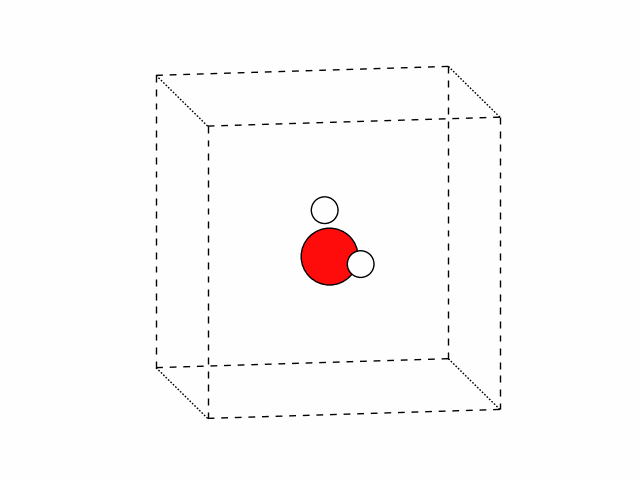
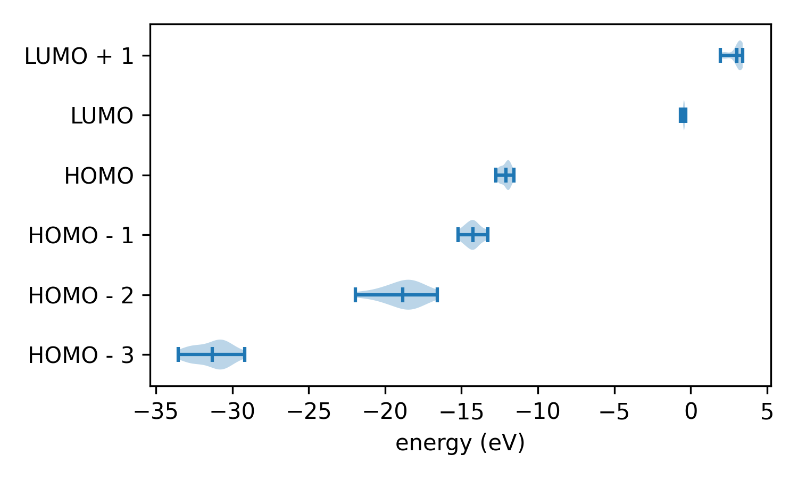
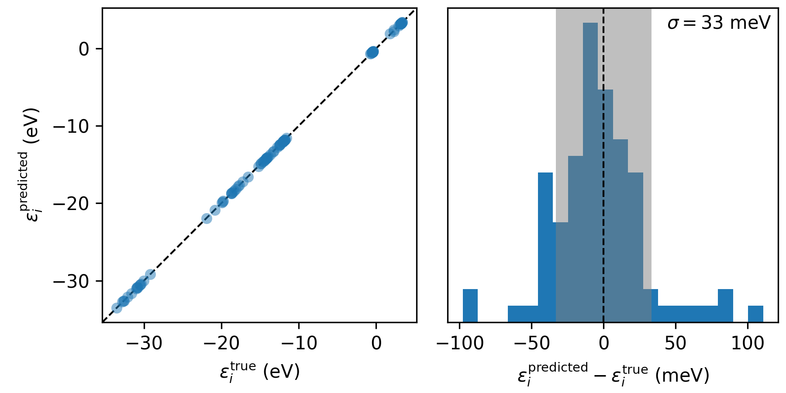
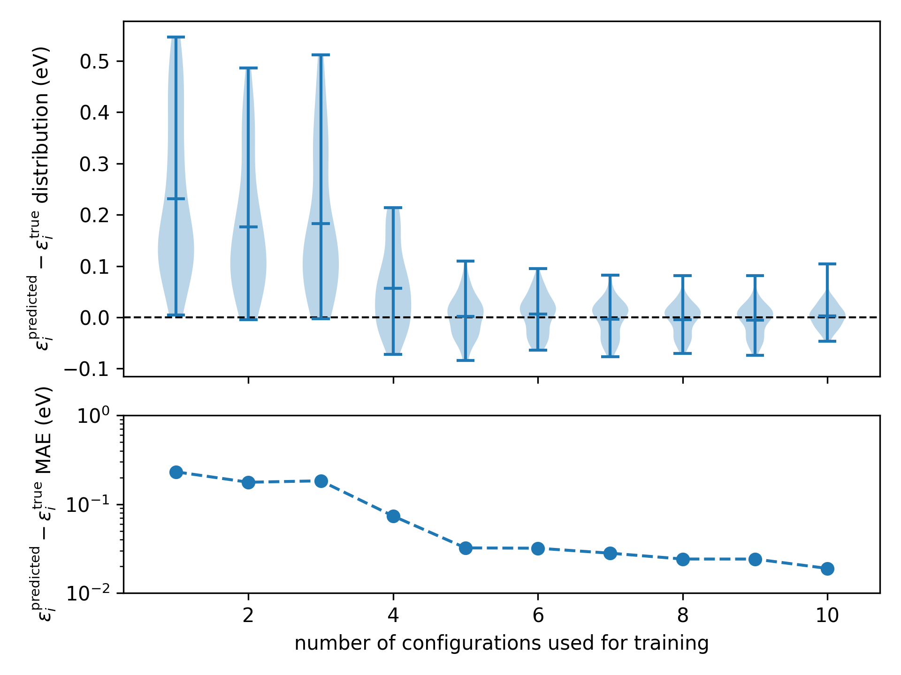

.. _tutorial_5:

Tutorial 5: using machine learning to predict the screening parameters of water molecules
=========================================================================================
In a Koopmans functional calculation, the most time-consuming step is the calculation of the screening parameters. In this tutorial, we will bypass this step by training a machine-learning model to predict the screening parameters directly from orbital densities.

The machine-learning strategy covered in this tutorial is viable when you want to perform many Koopmans functional calculations on similar systems e.g. different snapshots from a molecular dynamics trajectory. To emulate this scenario, we artificially generate 20 different water molecules with different atomic configurations (using :download:`this script <../../tutorials/tutorial_5/generate_configurations.py>` that applies random noise to the atomic positions of a water molecule). The atomic positions of these configurations can be seen in the figure below.

.. note::
  In anticipation that machine learning models are most useful in extended systems (i.e. liquids or solids), we will apply periodic boundary conditions and use maximally localized Wannier functions as our variational orbitals (despite the fact that this toy water model is not, in fact, a periodic system).

Training the model
------------------

To predict the screening parameters with the machine learning model we must first train the model. The input file doing so can be downloaded :download:`here <../../tutorials/tutorial_5/01-train/h2o_train.json>`. 

First, we have to specify that we want to perform Koopmans calculations on a whole trajectory of snapshots by setting the ``"task"`` keyword in the ``"workflow"`` block:

.. literalinclude:: ../../tutorials/tutorial_5/01-train/h2o_train.json
  :lines: 2-4
  :linenos:
  :emphasize-lines: 2
  :lineno-start: 24

For this task, we don't provide the ``"atomic_positions"`` directly to the input file since we don't want to perform a Koopmans calculation on a single snapshot but on many snapshots. Instead, we provide an ``.xyz`` file containing all the atomic positions of each snapshot that we would like to simulate

.. literalinclude:: ../../tutorials/tutorial_5/01-train/h2o_train.json
  :lines: 20-23
  :linenos:
  :emphasize-lines: 3
  :lineno-start: 20

Note that this ``.xyz`` file contains five confiugurations of water.

Finally, to enable the machine-learning process we provide a ``ml`` block and set ``train`` to ``true``:

.. literalinclude:: ../../tutorials/tutorial_5/01-train/h2o_train.json
  :lines: 13-19
  :linenos:
  :lineno-start: 13

The remaining keywords in the ``ml`` block are the hyperparameters of the machine learning model.

.. note::

  To predict screening parameters from orbital densities, we have to translate the orbital densities into input vectors for the machine learning model. To do so, we decompose the orbital densities into radial basis functions :math:`g_{nl}(r)` and angular basis functions :math:`Y_{ml}(\theta,\phi)`. 
  This decomposition has the following four hyperparameters that we provided in the input file:

  * :math:`n_{max}` determines the number of radial basis functions
  * :math:`l_{max}` determines the number of angular basis functions
  * :math:`r_{min}` determines the smallest cutoff radius for the radial basis functions
  * :math:`r_{max}` determines the largest cutoff radius for the radial basis functions

Running this calculation, you will see the five Koopmans calculations (for each of the training snapshots). The one extra step that you will spot that is not present in earlier tutorials is the power spectrum decomposition step, where the orbital densities are converted into a power spectrum

.. literalinclude:: ../../tutorials/tutorial_5/h2o_train.out
  :lines: 49-57
  :language: text
  :lineno-start: 49

Once the calculation is complete you will see a new file: ``h2o_train_ml_model.pkl``. This file contains the trained machine learning model.

Using the model
---------------

Now that we have a model at our disposal, we can use it to predict the screening parameters of the remaining snapshots. The input file for this task can be downloaded :download:`here <../../tutorials/tutorial_5/02-predict/h2o_predict.json>`. The key difference between this input file are that we now feed it a different set of water configurations, and we modify the ``ml`` block to use the trained model:

.. literalinclude:: ../../tutorials/tutorial_5/02-predict/h2o_predict.json
  :lines: 13-20
  :linenos:
  :emphasize-lines: 2-3
  :lineno-start: 13

Running this calculation, you will see that the core of the ΔSCF cycle -- the :math:`N \pm 1` calculations -- are skipped, and the predicted screening parameters are reported instead:

.. literalinclude:: ../../tutorials/tutorial_5/h2o_predict.out
  :lines: 619-621
  :language: text
  :lineno-start: 619

Note that the calculation still takes some time to complete, because some ab initio calculations (Wannierization, power spectrum decomposition, and the final KI calculation) are still performed.

Using :download:`this script <../../tutorials/tutorial_5/02-predict/plot.py>` we can plot the distribution of the orbital levels across the snapshots.

Of course, these particular distributions don't correspond to anything physical because the configurations were generated randomly. And furthermore, can we trust these results? We have skipped one important step: testing our model!

Testing the model
-----------------

To test a model, we need to compare predicted screening parameters against those calculated ab initio. The input file for this task can be downloaded :download:`here <../../tutorials/tutorial_5/03-test/h2o_test.json>`. The key difference between this input file and the previous one is

.. literalinclude:: ../../tutorials/tutorial_5/03-test/h2o_test.json
  :lines: 13-20
  :linenos:
  :emphasize-lines: 2
  :lineno-start: 13

Running this calculation, you will see the same output as in the previous calculation, but with the reappearance of the :math:`N \pm 1` calculations that are required to calculate the screening parameters ab initio.

.. literalinclude:: ../../tutorials/tutorial_5/03-test/h2o_test.out

We can compare the results using the :download:`accompanying python script <../../tutorials/tutorial_5/03-test/plot.py>`, which extracts the orbital energies from the ``.kwf`` file and generates the following plot

   
   The accuracy of the orbital energies when using machine-learned screening parameters (:math:`\varepsilon_i^\mathsf{predicted}`) relative to those calculated ab initio (:math:`\varepsilon_i^\mathsf{true}`) across the 15 test configurations.

Now we can understand the accuracy of our model: we can expect the orbital energies to be predicted within 40 meV of the ab initio Koopmans result. This is pretty good, given how rudimentary the model is and how little training it required! 

More advanced testing (extra for experts)
-----------------------------------------

So far, all of these tasks have relied on the pre-built workflows in the `koopmans` package. However, it is possible to use ``python`` to perform much more bespoke workflows. In `the script provided in the final part of this tutorial <../../tutorials/tutorial_5/04-advanced-testing/train-and-verify.py>` this functionality is leveraged to perform a convergence test on the accuracy of the machine-learning model as the number of training snapshots is increased.

For more details, refer to the script itself. Running the script generates the following plot

   
   The accuracy of the machine-learning model as a function of the number of configurations used during training

  Here we can see after X training confurations the accuracy of the model saturates.

