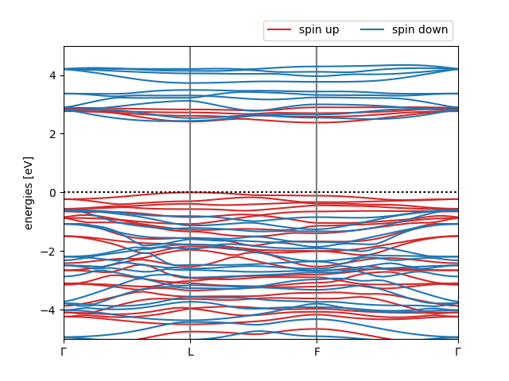

.. _tutorial_6:

Tutorial 6: the band structure of ferromagnetic bulk CrI\ :sub:`3`
==================================================================

In this tutorial we will calculate the band structure of the bulk ferromagnetic semiconductor CrI\ :sub:`3` using the supercell approach. The input file for this tutorial can be downloaded :download:`here <../../tutorials/tutorial_6/cri3.json>`.

The input file
^^^^^^^^^^^^^^

First, let us inspect the input file:

.. literalinclude:: ../../tutorials/tutorial_6/cri3.json
  :lines: 1-10
  :lineno-start: 1
  :emphasize-lines: 4,6,10

Here we tell the code to calculate the KI bandstructure using the ΔSCF supercell cell approach. We will not actually calculate the screening parameters in this tutorial (because this calculation takes a bit of time) so we have set ``calculate_alpha`` to ``False`` and we have provided a reasonable value for the screening parameters in the ``alpha_guess`` field. (This value corresponds to the inverse of the (average of the) macroscopic dielectric function, computed using DFT.)

In its low-temperature phase, bulk CrI\ :sub:`3` is a ferromagnetic semiconductor with 3 unpaired *d* electrons on each of the two Cr atoms in the primitive cell. We provide this information in the input file by setting ``spin_polarized`` to ``true`` and by specifying the expected total magnetization in the ``calculator parameters`` block.

.. note::

  When running magnetic systems, the keyword ``starting_magnetization`` (documented `here <https://www.quantum-espresso.org/Doc/INPUT_PW.html#idm301>`_) can help ``Quantum ESPRESSO`` find the ground state faster. As an optional exercise, try providing this keyword in your input file, choosing appropriate values based on the above description of the expected magnetic state of CrI\ :sub:`3`.

For a magnetic systems two sets of Wannier projections need to be provided, one for each spin channel. This is specified by splitting the ``w90`` block into an ``up`` and ``down`` sub-blocks:

.. literalinclude:: ../../tutorials/tutorial_6/cri3.json
  :lines: 55-79
  :lineno-start: 55
  :emphasize-lines: 2, 16

As already seen for ZnO in :ref:`Tutorial 3 <tutorial_3>`, we will use of the block-Wannierization functionality to wannierize each block of bands separately.  The projections provided above have been determined looking at the pDOS of the material as explained in :ref:`Tutorial 3 <projections_blocks_explanation>`. The first four projections span the occupied manifold. Note that the fourth one differs between the two spin channels reflecting the different number of electrons in the up and down channels. The fifth projection in the up channel, and the fifth and sixth projections in the down channel span the low-lying part of the empty manifold. 

The rest of the input file contains the atomic coordinates and :math:`k`-point configuration, as per usual.

Running the calculation
^^^^^^^^^^^^^^^^^^^^^^^

Running ``koopmans cri3.json`` should produce an output with several sections printing information on the different steps: after the header, the Wannierization is performed for the two spin channels, one at the time:

.. literalinclude:: ../../tutorials/tutorial_6/cri3.out
  :lines: 23-25
  :lineno-start: 23
  :language: text

...

.. literalinclude:: ../../tutorials/tutorial_6/cri3.out
  :lines: 38-40
  :lineno-start: 38
  :language: text

Having completed the Wannierization, the results are converted to a supercell for subsequent ``kcp.x`` calculations, and the DFT initialization in the supercell is run. If we had instructed the code to calculate the screening parameters, this would then be followed by an extra step where these are calculated. But since we have told the code not to compute the screening parameters, the workflow progresses immediately to the final step

.. literalinclude:: ../../tutorials/tutorial_6/cri3.out
  :lines: 90-92
  :lineno-start: 90
  :language: text

where the KI Hamiltonian is constructed and diagonalized in the supercell. To get the final band structure plot on the path specified in the input file, a postprocessing step is needed to unfold the bands from the Γ-point of the supercell into the Brillouin zone of the primitive cell: 

.. literalinclude:: ../../tutorials/tutorial_6/cri3.out
  :lines: 95-100
  :lineno-start: 95
  :language: text

Plotting the results
^^^^^^^^^^^^^^^^^^^^

To plot the final KI band structure, we will load all of the information from the ``cri3.kwf`` file, as we already did for ZnO in :ref:`Tutorial 3 <tutorial_3>`. This is done in the ``plot_bands.py`` script, which generates the following figure:

  The KI\@LDA band structure of ferromagnetic CrI\ :sub:`3`

.. warning:: 

  Although qualitatively correct, this calculation and the final band structure is far from converged. In particular, the energy cut-off and the supercell size needs to be increased to obtain reliable results.
